# User Manual for SecureShare

# Table of Content 

- [Introduction](#introduction)
- [Getting Started](#)

# Introduction

Welcome to SecureShare, a platform that aims for secure, end-to-end encrypted file sharing.

## What is SecureShare?

Secure Share is a cloud-based file-sharing platform developed to protect user privacy through end-to-end encryption (E2EE). Unlike traditional platforms like Google Drive or Dropbox, which store files in an accessible format on the cloud, Secure Share ensures that only the intended sender and recipient can view the contents of a shared file.

This platform encrypts files before they are uploaded, and they are only decrypted after download by an authorized recipient. The encryption process uses industry-standard cryptographic techniques such as AES for file encryption and RSA/X3DH for secure key exchanges.

Secure Share was developed with the vision of providing a privacy-focused, secure, and user-friendly file-sharing experience for a wide range of users—from businesses and developers to journalists and privacy-conscious individuals. Whether you're sharing sensitive documents, private media, or secure contracts, SecureShare keeps your data in your hands—and out of reach from third parties.

# Getting Started

## System Requirements

- Modern web browser
- Internet connection

## Accessing Landing page

Visit the SecureShare site(currently ran on localhost)

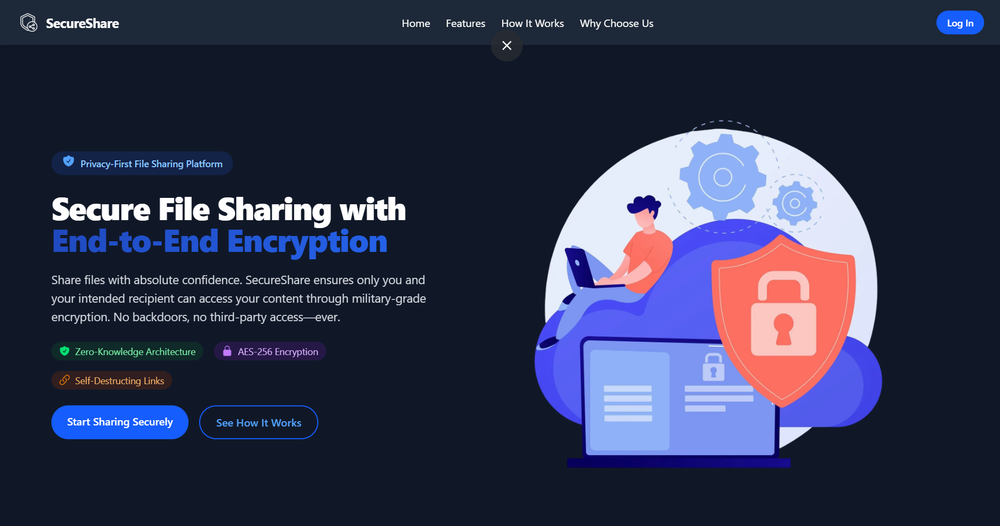

## Creating an Account

1. Navigate to the "Log In" button on the landing page and click on it.

*(The following page would be visible after doing so)*

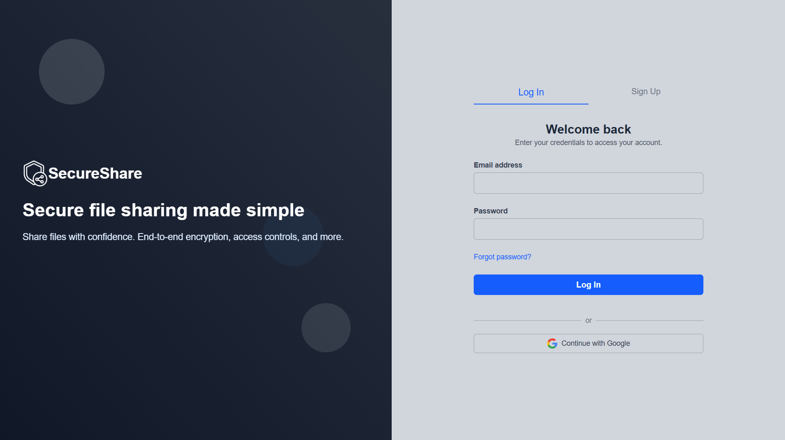

2. Click on "Sign Up"

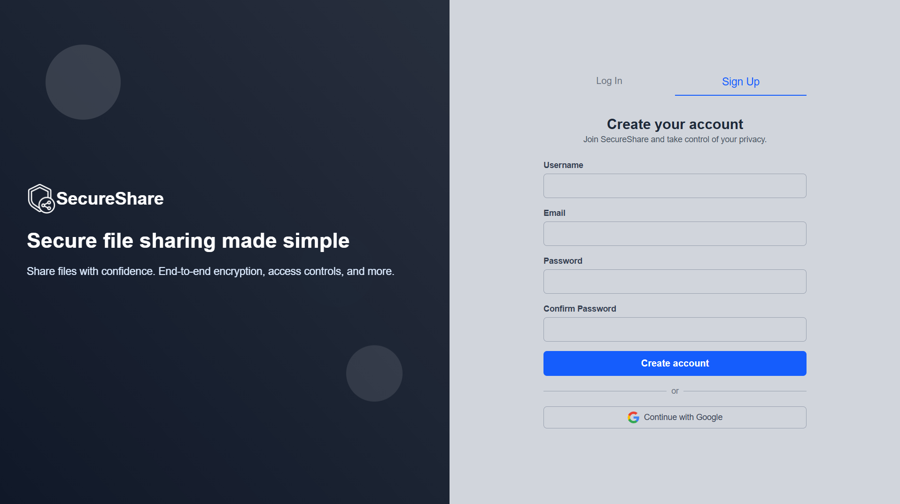

3. Enter your username, email and password.

4. Click "Create Account".

# Logging In

1. Navigate to the "Log In" button on the landing page and click on it.
2. Enter your email and password.

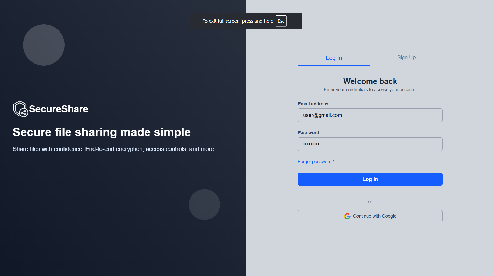

3. Click "Log In"

# Dashboard Overview

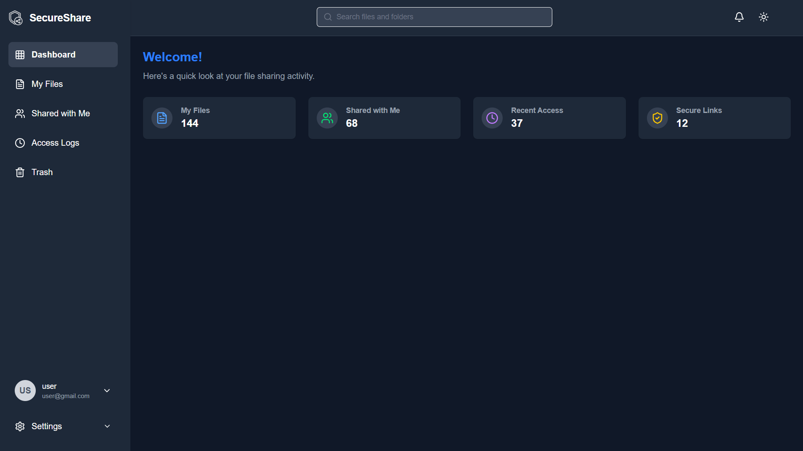

## The top navbar is your navigation hub. 

Here's a description of each:
- **Search:** Allows you to search the current page.
- **Bell:** This is for your notifications ( click on it to view notifications)
- **Theme setter:** This is a theme setter (night or light mode)

## The left sidebar is your navigation hub. 

Here's a description of each:
- **My Files:** View, upload, and organize your files
- **Shared with Me:** Files others have shared with you
- **Trash:** Deleted files, recover or permanently delete
- **Activity Logs:** See who accessed your files and when
- **Account:** This allows a user to logout.
- **Settings:** Theme, account preferences, and key management

## Main:

- This includes your statistics.

# Uploading Files

1. Navigate to your "My Files" tab and click on it.

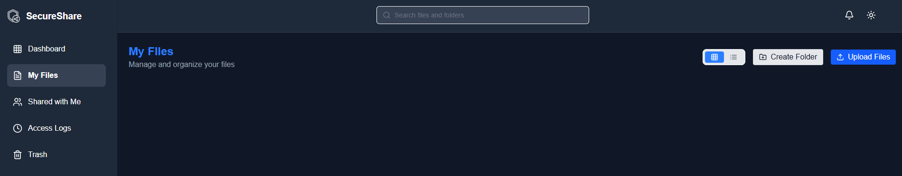

2. Click on the "Upload Files" button.

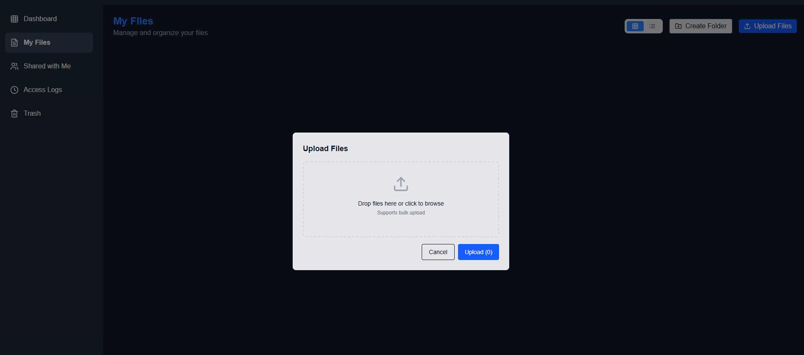

3. Then upload files according to preference. 
4. Click on "Upload". 

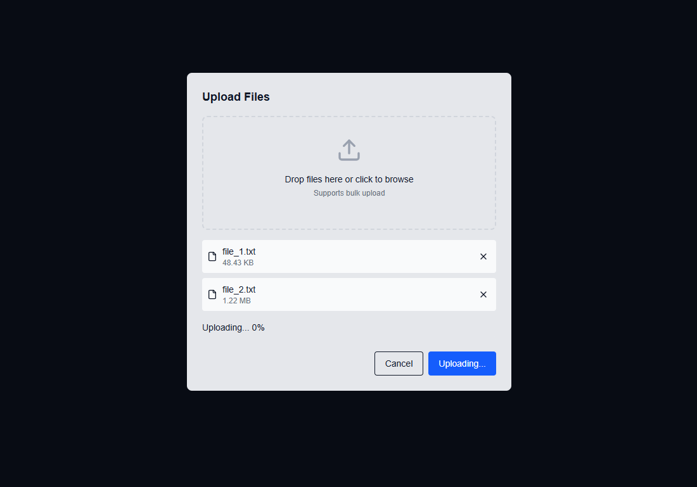

# Creating Folders

1. Navigate to your "My Files" tab and click on it.
2. Click on "Create Folder".

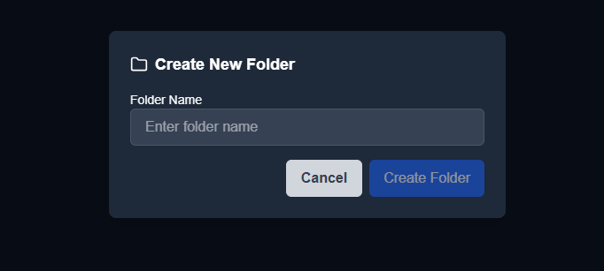

3. Add the foldername of your choice then select "Create Folder".

# Sharing Files

1. Right click on the file you want to share.
2. Click on "Share".
3. Enter the email address of the user you want to send to.
4. Click the add button.

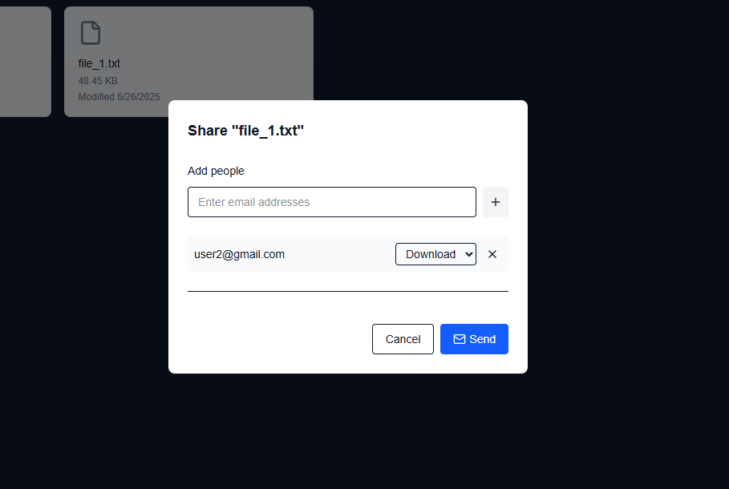

5. Once you have placed all the users you wish to share to, click "Send".

# Menu Actions

Right click on a file to get the menu.

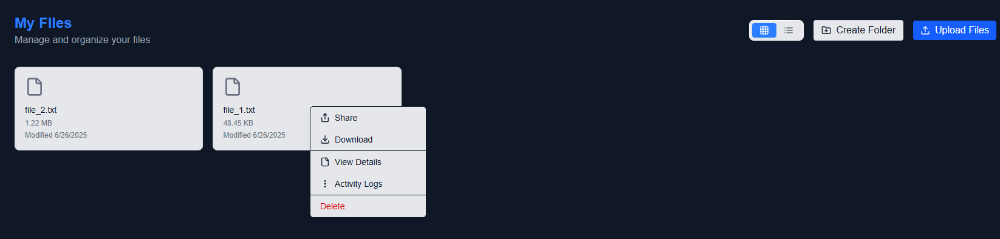

## Downloading a File 

1. Right click on the file you want download.
2. Click on "Download" and file should automatically begin downloading.

## View File Details

1. Right click on the file you want to view.
2. Click on "View Details".

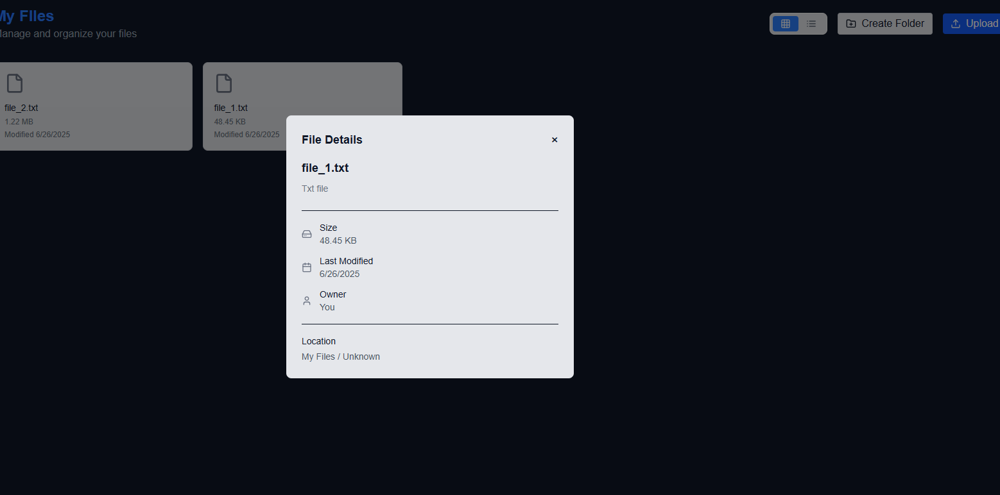

3. To close, click on the 'x' in the right corner.

## View Activity Logs

1. Right click on the file you want to view.
2. Click on "Activity Logs".

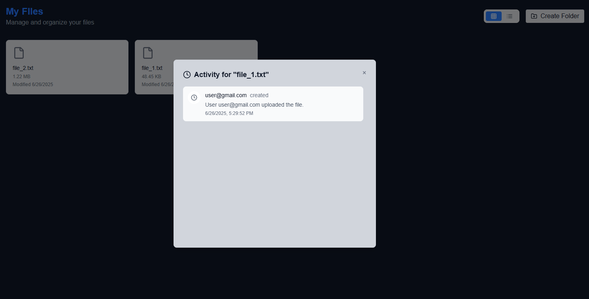

3. To close, click on the 'x' in the right corner.

## Delete

1. Right click on the file you want to delete.
2. Click on "Delete".

# Trash

This page can be accessed on the left nav-bar and by clicking on "Trash". This page is where deleted files move.

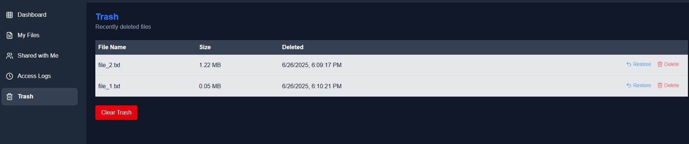

- Click "Restore" to restore the file
- Click "Delete" to permanently delete the file
- Click "Clear Trash" to permanently delete all files.

# Security Features

 - AES-256 for file Encryption
 - X3DH for secure file exchange
 - End-to-end encryption (E2EE)
 - Activity logging for transparency

 # Contact & Support

- Email : cacheme.2025@gmail.com
- Website: ( run on localhost to get access to more help features.)
